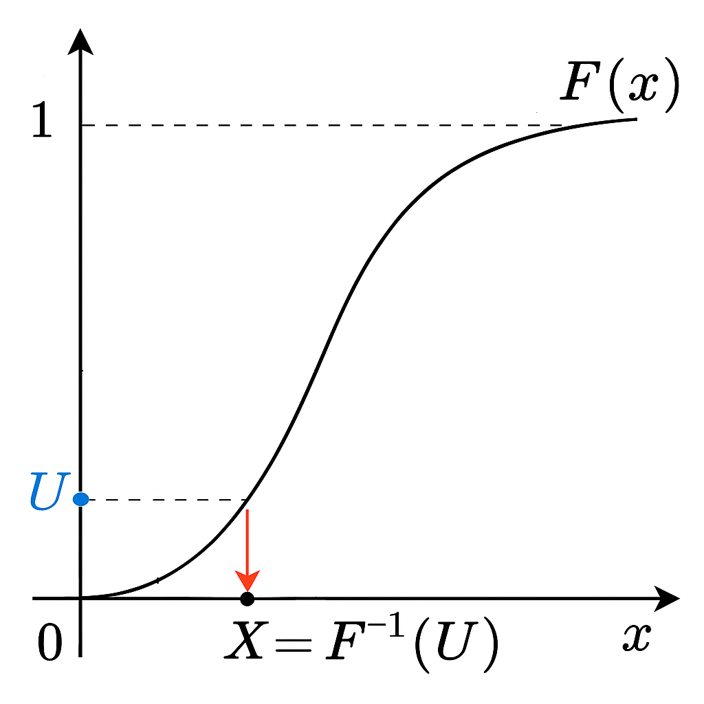

# Distribuições de Probabilidade

Um dos pilares da estatística é a teoria das distribuições de probabilidade, que descreve o comportamento dos dados e nos permite fazer previsões e inferências. Mas por que estudá-las computacionalmente? 

- Exploração visual e interativa
- Simulação de Fenômenos Reais
- Inferência Estatística e Modelagem
- Tomada de Decisão Baseada em Probabilidade

Essa abordagem permite que vejamos a estatistica além das fórmulas, transformando conceitos abstratos em algo visual e intuitivo. 

Dito isso, no R temos uma família de funções que nos permitem trabalhar com distribuições de probabilidade. Essas funções são divididas em quatro categorias principais:

- **d**: Função de densidade de probabilidade 
- **p**: Função de distribuição acumulada 
- **q**: Função quantil 
- **r**: Função de geração de números aleatórios

Essas funções são aplicáveis a diversas distribuições, como Normal, Binomial, Poisson, entre outras. Vamos explorar cada uma delas com exemplos práticos.

## Distribuições de Probabilidade Discretas

Nesta seção, vamos dedicar nosso estudo ao estudo computacional de duas distribuições discretas: Binomial e Poisson. 

### Distribuição Binomial

A distribuição binomial é uma distribuição discreta que modela o número de sucessos em n tentativas independentes de um experimento de Bernoulli (experimento 0 ou 1), onde cada tentativa tem apenas dois possíveis resultados: sucesso ou fracasso. A distribuição binomial é amplamente usada em situações onde há repetição de experimentos independentes, como:

 - O número de vezes que um aluno acerta uma questão em uma prova de múltipla escolha com alternativas ao acaso.
 - O número de clientes que compram um produto entre os que entram em uma loja.
 - O número de peças defeituosas em um lote de produção.

A função de probabilidade de uma variável aleatória X com distribuição binomial é dada por:

$$
P(X = k) = \binom{n}{k} p^k (1-p)^{n-k}, \quad x = 0,1,2,\ldots,n
$$

em que o parâmetro p é a probabilidade de sucesso. Além disso, as fórmulas da média e variância associadas a essa distribuição são

$$
E(X) = n \cdot p
$$

e

$$
Var(X) = n \cdot p \cdot (1-p)
$$

respectivamente, onde n é o número de tentativas.

Agora, vamos para um exemplo. Considere a seguinte situação problema: Uma empresa realiza uma pesquisa de satisfação com seus clientes. Sabe-se que cada cliente tem uma probabilidade `p` de estar satisfeito com o produto ou serviço prestado. A empresa decide amostrar `n` clientes aleatoriamente para avaliar sua satisfação. Podemos modelar o número de clientes satisfeitos na amostra como uma distribuição binomial. Vamos considerar, inicialmente, que o tamanho da amostra seja n=10 e o parâmetro p seja igual a 0,50. Dessa forma, tem-se um valor esperado de 5 pessoas satisfeitas nessa amostra. Podemos usar as funções `d`, `p` e `q` para calcular quantidades de interesse sobre esta distribuição. Para a utilização dessas funções, os argumentos que representam os parâmetros da distribuição binomial são o `size` e `prob`.

```{r}
# Definindo os parâmetros da distribuição binomial
n <- 10  # número de tentativas
p <- 0.5 # probabilidade de sucesso

# A probabilidade de exatamente 4 clientes estarem satisfeitos
dbinom(4, size = n, prob = p)

# A probabilidade de que menos de 6 clientes estejam satisfeitos:
pbinom(5,size=10,p=0.5)

# A probabilidade de que mais de 9 clientes estejam satisfeitos:
1-pbinom(9,size=10,p=0.5)

# A probabilidade de que mais de 9 clientes estejam satisfeitos:
pbinom(9,size=10,p=0.5,lower.tail=F)

# O percentil 75 do número de clientes satistfeitos:
qbinom(0.75,size=10,p=0.5)
```

Vamos gerar uma amostra desta distribuição com a função r e visualizá-la graficamente.

```{r}
# tamanho da amostra gerada
n_amostra=100

# media verdadeira
media = 10*0.5

# gerando os dados
set.seed(2025) # Fixar a semente para gerarmos juntos as mesmas amostras
dados <- rbinom(n_amostra, size=10,p=0.5)

# Criar data frame
df <- data.frame(valor = dados)
  
# Criar data frame das probabilidades teóricas
df_teorico <- data.frame(
    valor = min(dados):max(dados),
    prob = dbinom(min(dados):max(dados), size=10,p=0.5)
  )
  
# Criar o gráfico
ggplot(df, aes(x = valor)) +
  
    # histograma
    geom_histogram(aes(y = ..count../sum(..count..)), binwidth = 1, 
                   fill = "lightblue", color = "black") +
  
    # ponto e segmento
    geom_point(data = df_teorico, aes(x = valor, y = prob), 
               color = "red", size = 2) +
    geom_segment(data = df_teorico, aes(x = valor, xend = valor, 
                                        y = 0, yend = prob),color = "red") +
  
    # acrescentar a média verdadeira em uma linha vertical
    geom_vline(xintercept = media, linetype = "dashed", color="blue",size=1)+
  
    labs(title = "Binomial (10,0.5)",
         x = "Valores", y = "Probabilidade") +
    theme_minimal() 
```

Para finalizar, vamos investigar o efeito de diferentes valores de n e p para esta situação problema.

```{r}
# Carregar os pacotes necessários
library(ggplot2)
library(patchwork)

# Função para gerar o gráfico (com a correção final)
gerar_grafico <- function(size, p) {
  
  # Tamanho da amostra 
  n_amostra <- 100
  
  # Gerar amostra da distribuição Binomial
  set.seed(2025) # Fixar a semente para gerarmos juntos as mesmas amostras
  dados <- rbinom(n_amostra, size = size, p = p)
  
  # Criar data frame
  df <- data.frame(valor = dados)
  
  # Criar data frame das probabilidades teóricas
  df_teorico <- data.frame(
    valor = 0:size,
    prob = dbinom(0:size, size = size, p = p)
  )
  
  # Calcular a média da distribuição Binomial
  media <- size * p 
  
  # Criar o gráfico
  ggplot(df, aes(x = valor)) +
    # histograma
    # CORREÇÃO FINAL: Usando after_stat(density) com binwidth = 1
    geom_histogram(aes(y = after_stat(density)), binwidth = 1, 
                     fill = "lightblue", color = "black") +
    
    # ponto e segmento para a probabilidade teórica
    geom_point(data = df_teorico, aes(x = valor, y = prob), 
               color = "red", size = 2) +
    geom_segment(data = df_teorico, aes(x = valor, xend = valor, 
                                        y = 0, yend = prob), color = "red") +
    
    # acrescentar a média verdadeira em uma linha vertical
    geom_vline(xintercept = media, linetype = "dashed", color = "blue", size = 1) +
    
    # Rótulos
    labs(title = paste("Binomial(", size, ",", p, ")", sep = ""),
         x = "Valores", y = "Densidade / Probabilidade") +
    theme_minimal() +
    scale_x_continuous(breaks = scales::pretty_breaks())
}

# Definir os valores de n e p
size <- c(10, 20)
p <- c(0.25, 0.50, 0.75)

# Criar todas as combinações possíveis de n e p
combinacoes <- expand.grid(size = size, p = p)

# Aplicar a função gerar_grafico para cada combinação
graficos <- lapply(1:nrow(combinacoes), function(i) {
  gerar_grafico(combinacoes$size[i], combinacoes$p[i]) 
})

# Combinar os gráficos usando patchwork
layout_graficos <- (graficos[[1]] | graficos[[3]] | graficos[[5]]) /
                   (graficos[[2]] | graficos[[4]] | graficos[[6]])

# Exibir o conjunto de gráficos
layout_graficos
```

O efeito gráfico das mudanças de n e p na distribuição binomial pode ser analisado separadamente para cada parâmetro:

 - **Aumento de n**: A distribuição se espalha mais, pois a variância da binomial é np(1-p), que cresce com n (mantendo p constante). Visualmente, o histograma se alarga e se torna mais suave, se aproximando de uma curva contínua.
 - **Aumento de p**: A distribuição se desloca para a direita, pois a média da binomial é np. Visualmente, a moda da distribuição se move para valores mais altos.

### Distribuição de Poisson

A distribuição Poisson é uma distribuição de probabilidade discreta que descreve o número de eventos que ocorrem em um intervalo fixo de tempo ou espaço, assumindo que esses eventos ocorrem com uma taxa constante e independentemente uns dos outros. Alguns exemplos clássicos de aplicação incluem:

 - Número de chamadas recebidas por um call center por minuto;
 - Número de defeitos em um metro quadrado de tecido;
 - Número de acidentes de trânsito em um cruzamento por dia;
 - Número de mutações genéticas em um trecho específico de DNA.

 A função de probabilidade de uma variável aleatória X com distribuição Poisson é dada por:

$$
P(X = x) = \frac{\lambda^x e^{-\lambda}}{x!}, \quad x = 0,1,2,\ldots
$$

em que $\lambda$ é o parâmetro da distribuição e representa a intensidade ou taxa de ocorrência. Por fim, lembre-se que os valores da média e variância associados a essa distribuição são:

$$
\begin{align*}
E(X) &= \lambda \\
Var(X) &= \lambda
\end{align*}
$$

A **equidispersão** é uma característica fundamental da distribuição Poisson e significa que **a variância é igual à média**. Isso implica que a dispersão dos dados **aumenta proporcionalmente ao valor médio de eventos**.

Para os estudos computacionais, suponha o seguinte exemplo: Uma central de atendimento recebe chamadas de clientes durante o dia. O número de chamadas por minuto pode variar, mas em média, a central recebe um número constante de chamadas por minuto. Esse tipo de fenômeno, onde os eventos (no caso, chamadas) ocorrem aleatoriamente, mas a uma taxa constante, pode ser modelado por uma distribuição Poisson. Vamos considerar, inicialmente, que o parâmetro $\lambda$ seja igual a 5. Dessa forma, tem-se uma média de 5 chamadas por minuto. Podemos usar as funções d, p e q para calcular quantidades de interesse sobre esta distribuição. Cada uma dessas funções têm o argumento lambda para a distribuição Poisson.

```{r}
# A probabilidade de exatamente 10 chamadas por minuto
dpois(10, lambda = 5) 
```

```{r}
# A probabilidade de receber 3 ou menos chamadas por minuto
ppois(3, lambda = 5)
```

```{r}
# A probabilidade de receber mais de 8 chamadas por minuto
1 - ppois(8, lambda = 5)
```

uma forma alternativa de calcular a probabilidade de receber mais de 8 chamadas por minuto é:

```{r}
# A probabilidade de receber mais de 8 chamadas por minuto
ppois(8,lambda=5,lower.tail=F)
```

```{r}
# O percentil 80 do número de chamadas recebidas por minuto
qpois(0.80, lambda = 5)
```

Vamos gerar uma amostra desta distribuição com a função r e visualizá-la graficamente:

```{r}
# tamanho da amostra  
n_amostra=100

# media verdadeira
media = 5

# gerando os dados
set.seed(2025) # Fixar a semente para gerarmos juntos as mesmas amostras
dados <- rpois(n_amostra, lambda=5)

# Criar data frame
df <- data.frame(valor = dados)
  
# Criar data frame das probabilidades teóricas
df_teorico <- data.frame(
    valor = min(dados):max(dados),
    prob = dpois(min(dados):max(dados), lambda=5)
  )
  
# Criar o gráfico
ggplot(df, aes(x = valor)) +
  
    # histograma
    geom_histogram(aes(y = ..count../sum(..count..)), binwidth = 1, 
                   fill = "lightblue", color = "black") +
  
    # ponto e segmento
    geom_point(data = df_teorico, aes(x = valor, y = prob), 
               color = "red", size = 2) +
    geom_segment(data = df_teorico, aes(x = valor, xend = valor, 
                                        y = 0, yend = prob),color = "red") +
  
    # acrescentar a média verdadeira em uma linha vertical
    geom_vline(xintercept = media, linetype = "dashed", color="blue",size=1)+
  
    labs(title = "Poisson(5)",
         x = "Valores", y = "Probabilidade") +
    theme_minimal() 
```

Para finalizar, vamos investigar o efeito de diferentes valores de λ para esta situação problema:

```{r}
# Função para gerar o gráfico
gerar_grafico <- function(lambda) {
  # Tamanho da amostra 
  n_sample=100
  
  # Gerar amostra da distribuição Poisson
  set.seed(2025) # Fixar a semente para gerarmos juntos as mesmas amostras
  dados <- rpois(n_sample, lambda=lambda)
  
  # Criar data frame
  df <- data.frame(valor = dados)
  
  # Criar data frame das probabilidades teóricas
  df_teorico <- data.frame(
    valor = min(dados):max(dados),
    prob = dpois(min(dados):max(dados), lambda=lambda)
  )
  
  # Calcular a média da distribuição Poisson
  media <- lambda  
  
  # Criar o gráfico
  ggplot(df, aes(x = valor)) +
    # histograma
    geom_histogram(aes(y = ..count../sum(..count..)), binwidth = 1, 
                   fill = "lightblue", color = "black") +
  
    # ponto e segmento
    geom_point(data = df_teorico, aes(x = valor, y = prob), 
               color = "red", size = 2) +
    geom_segment(data = df_teorico, aes(x = valor, xend = valor, 
                                        y = 0, yend = prob),color = "red") +
  
    # acrescentar a média verdadeira em uma linha vertical
    geom_vline(xintercept = media, linetype = "dashed",color="blue",size=1)+
  
    labs(title = paste("Poisson(", lambda, ")", sep = ""),
         x = "Valores", y = "Probabilidade") +
    theme_minimal()  +
    scale_x_continuous(limits = c(0, 30))  
}

# Usar lapply para gerar os gráficos para diferentes valores de lambda
lambdas <- c(5, 10, 15)
graficos <- lapply(lambdas, gerar_grafico)

# Combinar os gráficos com patchwork
graficos[[1]] + graficos[[2]] + graficos[[3]] + plot_layout(ncol = 1)
```

Podemos observar que quanto mairo o valor de $\lambda$ na distribuição Poisson:

 - A média e a variância aumentam: Como a média e a variância de uma distribuição Poisson são iguais a λ, aumentar λ resulta em uma distribuição com maior média e maior variabilidade.
 - A distribuição fica mais simétrica: Para valores pequenos de λ, a distribuição é assimétrica, com um pico mais próximo de 0 e caudas assimétricas à direita. À medida que λ aumenta, a distribuição torna-se mais simétrica.
 - O pico da distribuição se desloca para valores maiores: O valor mais provável (a moda) se aproxima de λ, então, à medida que λ aumenta, o pico da distribuição se desloca para a direita. Isso implica que, à medida que λ cresce, o número de eventos mais provável se desloca para valores mais altos.
 - O intervalo de valores possíveis se expande: Para valores grandes de λ, a distribuição Poisson abrange um intervalo maior de valores possíveis, com a maior parte da probabilidade concentrada em torno de λ, mas com mais probabilidade de ocorrerem valores bem distantes da média.
 - Probabilidade de 0 eventos diminui: A probabilidade de observar 0 eventos diminui com o aumento de λ.

### Aproximação da Distribuição Binomial pela Poisson

A aproximação Poisson para a distribuição binomial é relevante porque permite simplificar cálculos probabilísticos quando n (o número de tentativas) é grande e p (a probabilidade de sucesso em cada tentativa) é pequeno. Em muitos contextos práticos, como na modelagem de eventos raros (por exemplo, número de falhas em um sistema ou mutações genéticas em um DNA), a distribuição binomial é a escolha natural, mas seu cálculo direto pode ser computacionalmente custoso para valores altos de n.

A distribuição Poisson fornece uma aproximação útil nesses casos, já que seu formato matemático é mais simples e os cálculos de probabilidade podem ser realizados sem recorrer a fatoriais ou coeficientes binomiais, que podem ser complicados para números grandes.

A aproximação Poisson para uma variável aleatória $X \sim \mathrm{Bin}(n, p)$ é dada por:

$$
X \approx Y \sim \mathrm{Poisson}(\lambda = np)
$$

A aproximação é boa quando $n$ é grande e $p$ é pequeno, de modo que $np$ (a média da binomial) se mantenha em um valor moderado (tipicamente menor que 10). Embora não haja um limite rígido, costuma-se considerar $n \geq 30$ e $p \leq 0.1$. Dessa forma, a aproximação Poisson funciona bem quando $np \leq 5$ ou, em alguns casos, até $np \leq 10$.

#### Exercício

Gere uma amostra de tamanho 200 de uma variável aleatória Binomial(n=50,p=0.05). Faça o histograma dessa amostra e acrescente a função de probabilidade da aproximação pela distribuição Poisson. Verifique se a aproximação é boa.

## Distribuições de Probabilidade Contínuas

Esta seção é dedicada ao estudo computacional de algumas distribuições contínuas, sendo elas a Exponencial, Normal e Gama.

### Distribuição Exponencial

A distribuição exponencial é amplamente utilizada em estatística e probabilidade, principalmente para modelar o tempo entre eventos, que ocorre de maneira contínua e independente ao longo do tempo. Aqui estão algumas aplicações básicas dessa distribuição:

 - Tempo de espera entre as ligações recebidas em um call center
 - Tempo até até a falha de um sistema ou produto
 - Tempo de decaimento de partículas radioativas.

A função de densidade de probabilidade de uma variável aleatória X com distribuição exponencial é dada por:

$$
f(x) = \lambda e^{-\lambda x}, \quad x \geq 0, \quad \lambda > 0
$$

em que o parâmetro $\lambda$ controla a **taxa de ocorrência dos eventos**. Ele está **diretamente relacionado à frequência** com que os eventos ocorrem ao longo do tempo. Por fim, lembre-se que os valores da média e variância associados a essa distribuição são:

$$
\begin{align*}
E(X) &= \frac{1}{\lambda} \\
Var(X) &= \frac{1}{\lambda^2}
\end{align*}
$$

Uma situação clássica onde a distribuição exponencial é aplicável é o tempo entre chegadas de clientes no caixa de uma loja. Suponha que em este tempo, em minutos, seja modelado por uma distribuição exponencial com parâmetro $\lambda$. Inicialmente, suponha que $\lambda = 1/2$ e, dessa forma, temos um tempo médio de 2 minutos entre as chegadas dos clientes. Podemos usar as funções `d`, `p` e `q` para calcular quantidades de interesse sobre esta distribuição. Para utilizar estas funções, o argumento que representa o parâmetro da distribuição exponencial é denotado por rate.

```{r}
# A probabilidade de que o tempo entre chegada de clientes é maior que 10 minutos
1-pexp(10,rate = 1/2)
```

```{r}
# A probabilidade de que o tempo entre chegada de clientes é maior que 10 minutos
pexp(10,rate = 1/2,lower.tail=F)
```

```{r}
# A probabilidade de que o tempo entre chegada de clientes é menor que 4 minutos
pexp(4,rate = 1/2)
```

```{r}
# A mediana do tempo entre chegada de clientes:
qexp(0.5,rate = 1/2)
```

Vamos gerar uma amostra desta distribuição com a função `r` e visualizá-la graficamente:

```{r}
# tamanho da amostra gerada
n_amostra=100

# media verdadeira
media = 2

# gerando os dados
set.seed(2025) # Fixar a semente para gerarmos juntos as mesmas amostras
dados <- rexp(n_amostra, rate = 1/2)

# Criar data frame
df <- data.frame(valor = dados)
  
# Criar data frame das probabilidades teóricas
df_teorico <- data.frame(
    valor = seq(min(dados),max(dados),0.1),
    dens = dexp(seq(min(dados),max(dados),0.1), rate = 1/2)
  )
  
# Criar o gráfico
ggplot(df, aes(x = valor)) +
  
    # histograma
    geom_histogram(aes(y = ..density..), 
                   fill = "lightblue", color = "black") +
  
    # gráfico de linha
    geom_line(data = df_teorico, aes(x = valor, y = dens), 
               color = "red", size = 1) +
    
    # acrescentar a média verdadeira em uma linha vertical
    geom_vline(xintercept = media, linetype = "dashed", color="blue",size=1)+
  
    labs(title = "Exponencial (1/2)",
         x = "Valores", y = "Densidade") +
    theme_minimal() +
    xlim(0,10)
```

Para finalizar, vamos investigar o efeito de diferentes valores de $\lambda$ para esta situação problema:

```{r}
# Função para gerar o gráfico
gerar_grafico <- function(rate) {
  # Tamanho da amostra 
  n_sample=100
  
  # Gerar amostra da distribuição Exponencial
  set.seed(2025) # Fixar a semente para gerarmos juntos as mesmas amostras
  dados <- rexp(n_sample, rate=rate)
  
  # Criar data frame
  df <- data.frame(valor = dados)
  
  # Criar data frame das probabilidades teóricas
  df_teorico <- data.frame(
    valor = seq(min(dados),max(dados),0.1),
    dens = dexp(seq(min(dados),max(dados),0.1), rate=rate)
  )
  
  # Calcular a média da distribuição Exponencial
  media <- 1/rate  
  
  # Criar o gráfico
  ggplot(df, aes(x = valor)) +
    # histograma
    geom_histogram(aes(y = ..density..),  
                   fill = "lightblue", color = "black") +
  
    # gráfico de linha
    geom_line(data = df_teorico, aes(x = valor, y = dens), 
               color = "red", size = 1) +
  
    # acrescentar a média verdadeira em uma linha vertical
    geom_vline(xintercept = media, linetype = "dashed",color="blue",size=1)+
  
    labs(title = paste("Exponencial (", rate, ")", sep = ""),
         x = "Valores", y = "Densidade") +
    theme_minimal()  +
    scale_x_continuous(limits = c(0, 10))  
}

# Usar lapply para gerar os gráficos para diferentes valores de rate
rates <- c(1/2, 1, 2)
graficos <- lapply(rates, gerar_grafico)

# Combinar os gráficos com patchwork
graficos[[1]] + graficos[[2]] + graficos[[3]] + plot_layout(ncol = 1)
```

Nota-se que, com o aumento de $\lambda$:

 - **Concentração perto de zero**: À medida que λ cresce, os valores pequenos da variável tornam-se mais prováveis.
 - **Decaimento mais rápido**: A curva da f.d.p. cai mais rapidamente para valores maiores da variável, indicando que a probabilidade de valores altos é menor.
 - **Média e dispersão**: A média e a variância diminuem com o aumento de λ, indicando que a distribuição fica mais concentrada perto de zero.

#### Perda de Memória

A propriedade de perda de memória (ou sem memória) da distribuição exponencial é uma característica importante e única dessa distribuição. Ela diz que a probabilidade de um evento ocorrer após um determinado tempo não depende do tempo que já passou sem o evento ocorrer. Formalmente, a propriedade de perda de memória pode ser enunciada da seguinte forma:

Se X é uma variável aleatória com distribuição exponencial, então para quaisquer $s, t \geq 0$:

$$
P(X > t + s \mid X > t) = P(X > s)
$$

Para ilustrar, considere X um tempo de falha, em dias, exponencialmente distribuido. A propriedade da perda de memória diz que dado um tempo de falha maior do que $t$, a probabilidade de ele ser maior que $t+s$ é igual a probabilidade de que ele seja somente maior que $s$. Isto é como se o relógio começasse a contar novamente a partir de $t$.

#### Exercício

Use o R, para mostrar que se $X \sim \text{exp}(\lambda = 1/100)$, então $P(X > 150 | X > 100) = P(X > 50)$.

### Distribuição Normal

A distribuição normal, também conhecida como distribuição de Gauss, é uma das distribuições mais importantes da estatística. Ela é uma distribuição contínua e simétrica em torno da média, modelando fenômenos naturais e diversas variáveis em contextos estatísticos.

Ela pode ser aplicada em diversas situações, como:

 - Distribuição de alturas de uma população;
 - Distribuição de erros de medição;
 - Distribuição de notas em uma prova.

A função densidade de probabilidade de uma variável aleatória X com distribuição normal é dada por:

$$
f(x) = \frac{1}{\sqrt{2\pi\sigma^2}} exp\left(-\frac{(x - \mu)^2}{2\sigma^2}\right) \quad x \in \mathbb{R}
$$

onde $\mu$ é a média e $\sigma^2$ é a variância da distribuição.

Um exemplo clássico de situação prática modelada pela distribuição normal é a altura de adultos em uma população. Se você medir a altura de um grande número de adultos de um mesmo grupo populacional (por exemplo, homens brasileiros adultos), perceberá que **os valores tendem a se concentrar em torno de uma média**, com poucas pessoas sendo muito mais altas ou muito mais baixas. Esse **padrão simétrico**, com a maioria dos valores próximos à média e **caudas que se afunilam para os extremos**, é característico da distribuição normal. Dessa forma, suponha que determinada população tenha a altura modelada pela distribuição normal com média $\mu = 170$ e desvio padrão $\sigma = 7 cm$. Podemos usar as funções `d`, `p` e `q` para calcular quantidades de interesse sobre esta distribuição. Nessas funções, os argumentos que representam os parâmetros da distribuição são `mean` e `sd`.

```{r}
# A probabilidade de que a altura de uma pessoa da população seja maior que 180 cm
1-pnorm(180,mean=170,sd=7)
```

```{r}
# A probabilidade de que a altura de uma pessoa da população seja maior que 180 cm
pnorm(180,mean=170,sd=7,lower.tail=F)
```

```{r}
# A probabilidade de que a altura de uma pessoa da população seja menor que 150 cm
pnorm(150,mean=170,sd=7)
```

```{r}
# A probabilidade de que a altura de uma pessoa da população esteja entre 140 cm e 150 cm
pnorm(150,mean=170,sd=7)-pnorm(140,mean=170,sd=7)
```

```{r}
# O percentil 95 do da altura de uma pessoa da população:
qnorm(0.95,mean=170,sd=7)
```

Vamos gerar uma amostra desta distribuição e visualizá-la graficamente:

```{r}
# tamanho da amostra gerada
n_amostra=100

# media verdadeira
media = 170

# gerando os dados
set.seed(2025) # Fixar a semente para gerarmos juntos as mesmas amostras
dados <- rnorm(n_amostra, mean=170,sd=7)

# Criar data frame
df <- data.frame(valor = dados)
  
# Criar data frame das probabilidades teóricas
df_teorico <- data.frame(
    valor = seq(min(dados),max(dados),0.1),
    dens = dnorm(seq(min(dados),max(dados),0.1), mean=170,sd=7)
  )
  
# Criar o gráfico
ggplot(df, aes(x = valor)) +
  
    # histograma
    geom_histogram(aes(y = ..density..),  
                   fill = "lightblue", color = "black") +
  
    # gráfico de linha
    geom_line(data = df_teorico, aes(x = valor, y = dens), 
               color = "red", size = 1) +
  
    # acrescentar a média verdadeira em uma linha vertical
    geom_vline(xintercept = media, linetype = "dashed", color="blue",size=1)+
  
    labs(title = "Normal (170,7)",
         x = "Valores", y = "Densidade") +
    theme_minimal()
```

Para finalizar, vamos investigar o efeito de diferentes valores de `mean` e `sd` para esta situação problema:

```{r}
# Função para gerar o gráfico
gerar_grafico <- function(mean,sd) {
  # Tamanho da amostra 
  n_amostra=100
  
  # Gerar amostra da distribuição de Normal
  set.seed(2025) # Fixar a semente para gerarmos juntos as mesmas amostras
  dados <- rnorm(n_amostra, mean=mean,sd=sd)
  
  # Criar data frame
  df <- data.frame(valor = dados)
  
  # Criar data frame das probabilidades teóricas
  df_teorico <- data.frame(
    valor = seq(min(dados),max(dados),0.1),
    dens = dnorm(seq(min(dados),max(dados),0.1), mean=mean,sd=sd)
  )
  
  # Calcular a média da distribuição Normal
  media <- mean
  
  # Criar o gráfico
  ggplot(df, aes(x = valor)) +
    # histograma
    geom_histogram(aes(y =..density..), 
                   fill = "lightblue", color = "black") +
  
    # gráfico de linha
    geom_line(data = df_teorico, aes(x = valor, y = dens), 
               color = "red", size = 1) +
  
    # acrescentar a média verdadeira em uma linha vertical
    geom_vline(xintercept = media, linetype = "dashed",color="blue",size=1)+
  
    labs(title = paste("Normal(", mean,",", sd, ")", sep = ""),
         x = "Valores", y = "Densidade") +
    theme_minimal()  +
    scale_x_continuous(limits = c(135,200))  
}

# Definir os valores de mu e sigma
mean <- c(160, 170)
sd <- c(5, 7, 10)

# Criar todas as combinações possíveis de mu e sigma
combinacoes <- expand.grid(mean = mean, sd = sd)

# Aplicar a função gerar_grafico para cada combinação
graficos <- lapply(1:nrow(combinacoes), function(i) {
  gerar_grafico(combinacoes$mean[i], combinacoes$sd[i]) 
})

# Combinar os gráficos usando patchwork
layout_graficos <- (graficos[[1]] | graficos[[3]] | graficos[[5]]) /
                   (graficos[[2]] | graficos[[4]] | graficos[[6]])

# Exibir o conjunto de gráficos
layout_graficos
```

O efeito do aumento de $\mu$ e $\sigma$ na função densidade de probabilidade de uma distribuição normal pode ser analisado assim:

 - Aumento de $\mu$: A curva se desloca horizontalmente para a direita, mantendo a mesma forma. Isso ocorre porque $\mu$ define a localização central da distribuição.
 - Aumento de $\sigma$: A curva se alarga e abaixa, espalhando os valores por uma faixa maior. Isso acontece porque $\sigma$ controla a dispersão: valores mais altos significam maior variação nos dados.

### Distribuição Gama

A distribuição Gamma é utilizada em diversas áreas quando se deseja modelar tempos de espera e tempos de vida.

Ela pode ser aplicada em diversas situações, como:

 - Tempo de vida de um componente eletrônico;
 - Tempo de espera até a ocorrência de um evento raro;
 - Tempo de espera entre chegadas de clientes em um sistema.

A função densidade de probabilidade de uma variável aleatória X com distribuição gama é dada por:

$$
f(x) = \frac{\beta^\alpha}{\Gamma(\alpha)} x^{\alpha-1} e^{-\frac{x}{\beta}}
$$

em que o parâmetro $\alpha$ é o parâmetro de forma (shape) e o parâmetro $\beta$ é a taxa (rate). Os valores da média e variância associados a essa distribuição são:

$$
\begin{align*}
E(X) &= \alpha \cdot \beta \\
Var(X) &= \alpha \cdot \beta^2
\end{align*}
$$

Utilizaremos, portanto, as funções `rgamma`, `dgamma`, `pgamma` e `qgamma` com os argumentos `shape` e `rate`.

Um hospital quer modelar o tempo de atendimento de pacientes na emergência. Sabe-se que o tempo total de atendimento depende de várias etapas, como triagem, consulta e exames. Esse tipo de fenômeno pode ser bem modelado pela distribuição Gamma, pois o tempo total até a conclusão de várias etapas sucessivas frequentemente segue essa distribuição. Considere, portanto, que o tempo total de atendimento, em horas, tem uma distribuição Gama com parâmetros $\alpha=2$ e $\beta=1$. Dessa forma, tem-se um tempo médio de atendimento de $\alpha/\beta=2$ horas.

#### Exercícios

1- Calcule as seguintes probabilidades:
 a) Qual a probabilidade de o tempo total de atendimento ser superior a 4 horas?
 b) Qual a probabilidade de o tempo total de atendimento estar entre 1 e 2 horas?
 c) Qual o tempo total de atendimento mediano?
 d) Determine o tempo t tal que 25% dos atendimentos no hospital levam mais que t horas para serem concluídos.

2- Simule uma amostra de tamanho 100 desta distribuição. Faça o histograma e acrescente a densidade verdadeira.

3- Considere agora um estudo computacional com amostras de tamanho 100 para avaliar o efeito dos parâmetros α e β. Neste estudo, envolva as distribuições:

 - Gama($\alpha = 1$, $\beta = 1$)
 - Gama($\alpha = 1$, $\beta = 2$)
 - Gama($\alpha = 2$, $\beta = 1$)
 - Gama($\alpha = 2$, $\beta = 2$)
 - Gama($\alpha = 3$, $\beta = 1$)
 - Gama($\alpha = 3$, $\beta = 2$)

Qual o efeito dos parâmetros na densidade dos dados?

4- Sabemos que Gama($\alpha = 1$, $\beta$) ≡ Exponencial($\lambda$=$\beta$). Assim, gere uma amostra de tamanho 100 de uma Gama($\alpha=1$,$\beta=4$) e sobreponha a densidade da distribuição Exponencial($\lambda=4$).

## Simulando Resultados Teóricos: Distribuição T-Student

No estudo de distribuições de probabilidade, é comum encontrar relações matemáticas entre diferentes distribuições. Algumas dessas relações podem ser demonstradas **analiticamente**, enquanto outras podem ser exploradas por meio de **simulações**. O R é uma excelente plataforma para esse tipo de investigação, permitindo gerar **amostras aleatórias**, **visualizar distribuições** e **verificar empiricamente** certas propriedades estatísticas.

O estudo das relações entre distribuições de probabilidade é fundamental para a estatística teórica e aplicada. Essas conexões permitem desenvolver **métodos estatísticos** mais poderosos, **justificar aproximações**, facilitar cálculos complexos e compreender o comportamento de estimadores e testes estatísticos.

Dessa forma, a distribuição T de Student surge naturalmente em estatística quando trabalhamos com **amostras finitas** e não conhecemos a **variância populacional**, para **populações normais**. A variável aleatória T que possui distribuição T-student com $v$ graus de liberdade é definida como:

$$
T = \frac{\bar{X} - \mu}{S / \sqrt{n}}
$$

onde:

 * $Z \sim N(0,1)$ é uma variável aleatória com distribuição normal padrão.
 * $W \sim \chi^2(v)$ é uma variável aleatória com distribuição qui-quadrado com $v$ graus de liberdade. 
 * $Z$ e $W$ são **independentes**. 

Lembre-se que $E(T)=0$ e $Var(T)=\frac{ν}{ν−2}$. Vamos gerar uma amostra da distribuição T com $ν=10$ graus de liberdade segundo a fórmula acima e, posteriormente, verificar a aproximação com a densidade verdadeira, a partir da função `dt`. Para a distribuição qui-quadrado, utilizaremos o comando rchisqcom o argumento df para os graus de liberdade da distribuição

```{r}
# tamanho da amostra gerada
n_amostra=200

# media verdadeira
media = 0

# gerando os dados
set.seed(2025) # Fixar a semente para gerarmos juntos as mesmas amostras
# Normal padrão
dadosZ <- rnorm(n_amostra, mean=0,sd=1)
# Qui-Quadrado
dadosChi <- rchisq(n_amostra,df=10)
# T-Student
dados <- dadosZ/sqrt(dadosChi/10)

# Criar data frame
df <- data.frame(valor = dados)
  
# Criar data frame das probabilidades teóricas
df_teorico <- data.frame(
    valor = seq(min(dados),max(dados),0.1),
    dens = dt(seq(min(dados),max(dados),0.1), df=10)
  )
  
# Criar o gráfico
ggplot(df, aes(x = valor)) +
  
    # histograma
    geom_histogram(aes(y = ..density..), 
                   fill = "lightblue", color = "black") +
  
    # gráfico de linha
    geom_line(data = df_teorico, aes(x = valor, y = dens), 
               color = "red", size = 1) +
  
    # acrescentar a média verdadeira em uma linha vertical
    geom_vline(xintercept = media, linetype = "dashed", color="blue",size=1)+
  
    labs(title = "T-student (10)",
         x = "Valores", y = "Densidade") +
    theme_minimal()
```

### Exercícios

1- Se $Y \sim Unif(0,1)$, então $-log(Y) \sim Exp(1)$. Use a função `runif` para a distribuição uniforme.

2- A soma de variáveis normais independentes também segue uma normal. Se $X1, X2, \ldots, Xn \sim N(\mu, \sigma^2)$, então $S = X1 + X2 + \ldots + Xn \sim N(n\mu, n\sigma^2)$. Para este exemplo, adote $n = 12, \mu = 10, \sigma = 2$.

## Como o R gera valores de distribuições de probabilidade

A geração de números aleatórios é um componente essencial da Estatística Computacional e da Simulação. Sempre que usamos funções como `rnorm()`, `rexp()` ou `rbinom()` no R, estamos gerando números de distribuições específicas. Mas como o R consegue criar números que seguem uma determinada distribuição de probabilidade?

A resposta está na geração de números pseudoaleatórios e em métodos matemáticos que transformam esses números para se adequarem a distribuições desejadas. O principal método utilizado para essa transformação é o método da **transformação inversa**, que exploraremos em detalhes nesta seção.

### Números Pseudoaleatórios e Sementes

Antes de falar sobre a **transformação inversa**, precisamos entender como os números “aleatórios” são gerados em um computador. Nesse sentido, vamos entender a diferença entre números verdadeiramente aleatórios e números **pseudoaleatórios**.

 * **Números aleatórios** vêm de fenômenos físicos imprevisíveis, como ruído térmico ou decaimento radioativo.
 * **Números pseudoaleatórios** são gerados por algoritmos determinísticos, que produzem sequências de números que parecem aleatórias, mas que na verdade são **completamente previsíveis** se a **semente inicial** (ou "seed") for conhecida.

Os números gerados no R (e em praticamente todas as linguagens de programação) são pseudoaleatórios, pois vêm de um gerador de números pseudoaleatórios (PRNG - Pseudo Random Number Generator).

O gerador de números aleatórios do R baseia-se no algoritmo **Mersenne Twister**, que é um dos geradores de números pseudoaleatórios mais utilizados devido à sua longa sequência periódica e boas propriedades estatísticas.

A **semente** (`set.seed()`) é um **número inicial** que determina o estado do PRNG. Se usarmos a mesma semente, o R produzirá exatamente os mesmos números aleatórios, o que é essencial para **reprodutibilidade** em estudos computacionais.

### O Papel da Distribuição Uniforme com Parâmetros (0,1)

A distribuição uniforme contínua no intervalo (0,1) tem um papel central na geração de números aleatórios. Isso acontece porque:

 * Ela é fácil de gerar computacionalmente.
 * Podemos transformá-la em muitas outras distribuições usando funções matemáticas adequadas.

No R, trabalhamos com essa distribuição a partir das funções `dunif`, `punif`, `qunif` e `runif`. Os argumentos dessa distribuição são `min` e `max` e, para o caso da uniform(0,1) geramos valores dessa distribuição com o seguinte comando:

```{r}
# Gerando 10 valores de uma distribuição Uniforme(0,1)
set.seed(42) # Define uma semente para reprodutibilidade

Amostra = runif(10, min=0, max=1) # Gera 10 números aleatórios de U(0,1)

print(Amostra)
```

Para gerar os dados de uma distribuição uniforme (0,1) o R, em sequência:

 1. **Semente inicial**: O gerador inicia com uma semente (definida pelo usuário via set.seed() ou aleatória). No caso de semente aleatória, o R pega um estado aleatório baseado no relógio do sistema, gerando sequências diferentes a cada execução.
 2. De acordo com o estado inicial (fixado ou aleatório) o R gera uma sequência de números **pseudoaleatórios** $K1,K2,K3,\ldots$
 3. Os números gerados são transformados para o intervalo (0,1) ao serem divididos pelo **maior valor possível** que o gerador pode produzir.

Uma vez que temos valores da distribuição Uniforme(0,1), podemos usar técnicas para convertê-los em amostras de outras distribuições. A mais conhecida dessas técnicas é o método da **transformação inversa**.

### Método da Transformação Inversa

O método da transformação inversa é uma técnica fundamental para gerar valores de distribuições arbitrárias a partir da distribuição uniforme U(0,1). Ele é amplamente usado porque permite transformar facilmente um gerador de números pseudoaleatórios uniforme em valores de determinadas distribuições.

A ideia central do método é a seguinte:

1. **Gerar um número aleatório** $u$ de uma distribuição uniforme U(0,1).
2. Transformamos $u$ aplicando a inversa da função de distribuição acumulada $F$, denotada por $F^{-1}(.)$, para obter um valor da distribuição desejada. Matematicamente, o valor $x$, gerado da distribuição de interesse, será dado por:

$$
x = F^{-1}(u)
$$

Esse método funciona porque a função $F$ de qualquer distribuição mapeia o intervalo (0,1) no suporte da variável aleatória. Assim, quando aplicamos sua inversa, obtemos valores com **a mesma distribuição da variável original**. Graficamente, temos a seguinte situação:



### Exemplo: Distribuição Exponencial

A função de distribuição F de uma distribuição exponencial é obtida fazendo:

$$
F(x) = \int_0^x \lambda e^{-\lambda t} dt = 1 - e^{-\lambda x}, \quad x \geq 0
$$

Na sequência, precisamos gerar valores $x$ dessa variável aleatória segundo o método da **transformação inversa**. Para um valor $u$, gerado a partir da distribuição uniforme(0,1), temos que encontrar $x=F^{-1}(u)$. Para isto, tem-se o seguinte raciocínio:

$$
F(x) = u \implies 1 - e^{-\lambda x} = u \implies e^{-\lambda x} = 1 - u \implies -\lambda x = \log(1 - u) \implies x = -\frac{1}{\lambda} \log(1 - u) \implies x = F^{-1}(u) 
$$

Assim, geramos o valor $x$ da distribuição exponencial, ao aplicar o valor $u$ na função $F^{-1}(u)$.

No R, vamos criar uma função para gerar os valores da distribuição exponencial dessa forma e, na sequência, gerar uma amostra de tamanho 100:

```{r}
# Gerando 100 valores de uma distribuição exponencial pelo método da transformação inversa
set.seed(2025)  # Define uma semente para reprodutibilidade

# Função Inversa
inv_exp = function(u,rate)
  return(-(1/rate)*log(1-u))

# Gerando a amostra
n_amostra = 100
u = runif(n_amostra,min=0,max=1)
dados = inv_exp(u=u,rate=1/2)

# media verdadeira
media = 2

# Criar data frame
df <- data.frame(valor = dados)
  
# Criar data frame das probabilidades teóricas
df_teorico <- data.frame(
    valor = seq(min(dados),max(dados),0.1),
    dens = dexp(seq(min(dados),max(dados),0.1), rate=1/2)
  )
  
# Criar o gráfico
ggplot(df, aes(x = valor)) +
  
    # histograma
    geom_histogram(aes(y = ..density..), 
                   fill = "lightblue", color = "black") +
  
    # gráfico de linha
    geom_line(data = df_teorico, aes(x = valor, y = dens), 
               color = "red", size = 1) +
    
    # acrescentar a média verdadeira em uma linha vertical
    geom_vline(xintercept = media, linetype = "dashed", color="blue",size=1)+
  
    labs(title = "Exponencial (1/2)",
         x = "Valores", y = "Densidade") +
    theme_minimal() +
    xlim(0,10)
```

Acabamos de fazer, portanto, o que a função `rexp()` faz automaticamente.

### Distribuição Cauchy

A **distribuição Cauchy** é uma distribuição de probabilidade **contínua** famosa por seu comportamento peculiar, especialmente porque **não possui média nem variância definidas**. Isso a torna um exemplo clássico de distribuição com **caudas pesadas**, usada em diversas aplicações teóricas e práticas. Suas aplicabilidades mais comuns são:

  * **Processos físicos**: descreve a ressonância de partículas na mecânica quântica.
  * **Robustez estatística**: usada para testar métodos estatísticos.
  * **Regressão robusta**: a distribuição Cauchy pode modelar erros com caudas pesadas.
  * **Aplicações em telecomunicações**: usada em modelos de interferência.

Particularmente, a função densidade de probabilidade de uma variável aleatória X com distribuição Cauchy é:

$$
f(x) = \frac{1}{\pi} \frac{\gamma}{(x - x_0)^2 + \gamma^2}, \quad -\infty < x < \infty
$$

onde $x_0$ é a localização da mediana e $\gamma$ é a escala, que determina a largura da distribuição.

O nosso objetivo é utilizar o método da transformação inversa para gerar dessa distribuição. Mas antes será necessário introduzir a distribuição Cauchy Padrão, que possui θ=0 e γ=1. A função densidade de probabilidade de uma variável aleatória Y com distribuição Cauchy padrão é:

$$
f(y) = \frac{1}{\pi} \frac{1}{y^2 + 1}, \quad -\infty < y < \infty
$$

A função de distribuição dessa variável é:

$$
F(y) = \frac{1}{2} + \frac{1}{\pi} \tan^{-1}(y) \quad y \in \mathbb{R}
$$

Existe um resultado, advindo de propriedades de distribuições da família locação-escala, que relaciona uma distribuição cauchy genérica com a distribuição cauchy padrão. Se $Y \sim Cauchy(0,1)$, então a variável $X=\theta+\gamma Y$ tem distribuição $Cauchy(\theta,\gamma)$.

### Exercício

Imagine que um atirador esteja utilizando um rifle de precisão, mas que, devido a um problema na calibração da mira, seus tiros tendam a atingir um ponto ligeiramente deslocado para a direita do alvo. Além disso, variações imprevisíveis no vento, pequenas oscilações na mão do atirador e imperfeições no equipamento ainda afetam a dispersão dos impactos. Nesse cenário, uma distribuição normal não seria adequada, pois presume que a variabilidade dos erros segue uma estrutura bem comportada com momentos finitos. No entanto, na prática, grandes desvios ocasionais podem ocorrer, como quando uma rajada de vento inesperada desvia um disparo para longe. Esse comportamento sugere que a distribuição Cauchy seja uma boa modelagem para o erro do impacto na horizontal.

Definição dos Parâmetros:

 * Parâmetro de localização $\theta$ = 8 cm: Devido à calibração inadequada, o atirador tende a acertar, em média, 8 cm à direita do centro do alvo.
 * Parâmetro de escala $\gamma$ = 5 cm: Este parâmetro reflete a dispersão dos impactos.

1- Use o método da **transformação inversa** para gerar uma amostra de tamanho 100 da distribuição cauchy padrão.

2- Use a propriedade $X=\theta+\gamma Y$, para gerar a distribuição Cauchy($\theta=8$,$\gamma=5$).

3- Use a função `dcauchy` para checar se a sua amostra foi bem gerada. Essa função tem como argumentos `location` e `scale`.

### Outros Métodos de Geração

O método da **transformação inversa** é uma abordagem fundamental para gerar amostras aleatórias a partir de distribuições de probabilidade arbitrárias. Como vimos, ele se baseia na **inversão da função de distribuição acumulada**, transformando números **uniformemente distribuídos** em números que seguem a distribuição desejada. O R usa este método para gerar as seguintes distribuições:

 * Exponencial
 * Cauchy
 * Gumbel
 * Laplace
 * Pareto
 * Weibull

Por depender, analiticamente, da função $F$, o método da transformação inversa possui algumas desvantagens. Para muitas distribuições, **a inversa não possui uma forma fechada**, o que pode dificultar ou até inviabilizar a implementação direta do método. Quando a inversa da FDA não tem uma forma analítica simples, precisamos recorrer a métodos numéricos (como **bissecção** ou **Newton-Raphson**) para encontrar $F^{-1}(u)$. Isso pode ser computacionalmente custoso, especialmente para distribuições complexas ou quando precisamos gerar um grande número de amostras rapidamente. Além disso, podem ocorrer erros de arredondamento, impactando a qualidade das amostras geradas. Se a distribuição tem múltiplos picos (multimodalidade), o método da transformação inversa pode ser ineficiente porque pode ser difícil encontrar a inversa de $F$ com precisão.

O R não usa **métodos numéricos** para calcular a inversa da função de distribuição acumulada ao gerar amostras de distribuições. Quando a inversa de $F$ não tem uma forma fechada, o R geralmente adota outros métodos mais eficientes:

 * Método de Box Muller ou Método polar de Marsaglia: Normal
 * Método de Aceitação-Rejeição: Gama, Beta, T, Qui-Quadrado e F
 * Método da Decomposição: Binomial e Poisson.