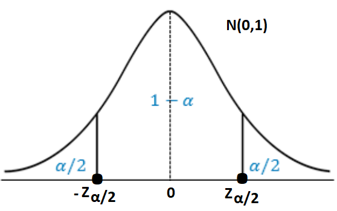
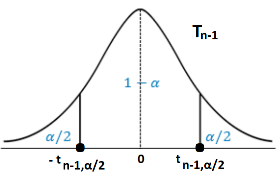
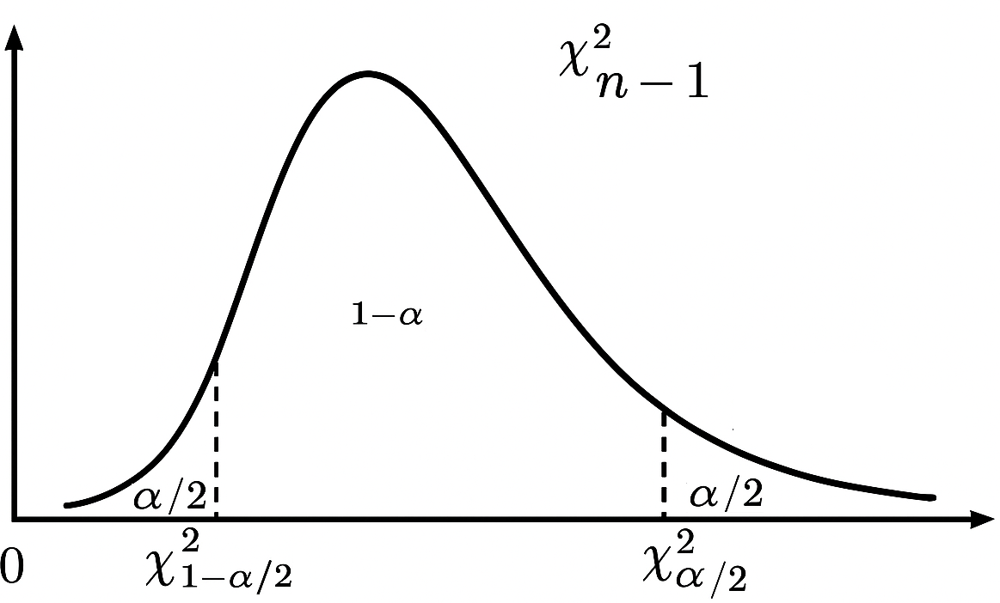
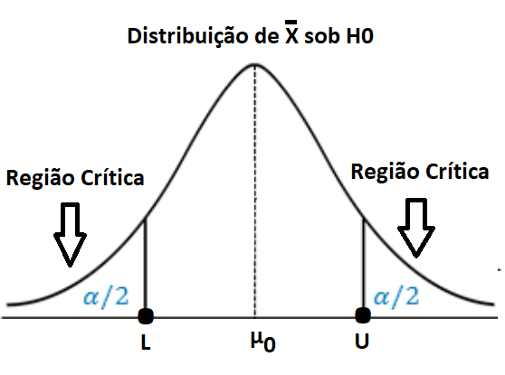
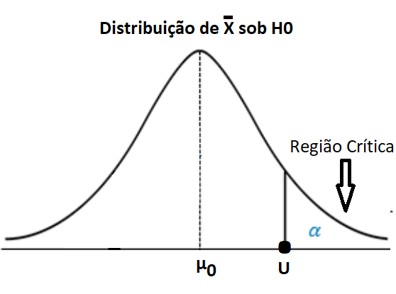

# Inferência para Uma População

Ao estudarmos a distribuição amostral de um estimador, demos um passo importante para responder a uma pergunta central da inferência estatística: “Quão confiável é o valor obtido a partir de uma única amostra?”

Agora é hora de usar esse conhecimento para tomar decisões concretas. A partir de uma estimativa pontual (como a média ou a proporção amostral), queremos expressar o grau de incerteza associado a essa estimativa, ou ainda, testar afirmações sobre a população com base nos dados da amostra.

Essas duas tarefas constituem os pilares da inferência estatística:

-   Intervalos de confiança, que fornecem uma faixa de valores plausíveis para o parâmetro populacional, com um certo nível de confiança.
-   Testes de hipótese, que avaliam se os dados oferecem ou não evidências suficientes para rejeitar uma suposição sobre a população.

O raciocínio por trás dessas ferramentas se ancora na distribuição amostral: Se sabemos como o estimador se comporta ao longo de muitas amostras, conseguimos avaliar o quanto o valor observado se desvia (ou não) do que seria esperado sob determinada hipótese. O enfoque computacional traz enormes vantagens para o aprendizado dessa etapa. Com simulações, podemos:

-   Construir empiricamente intervalos de confiança, observando em que proporção eles contêm o verdadeiro parâmetro.
-   Visualizar a lógica dos testes de hipótese, comparando valores observados com a distribuição sob a hipótese nula.
-   Entender o erro tipo I e tipo II de forma intuitiva, simulando diferentes cenários.
-   Explorar o impacto do tamanho da amostra, da variabilidade e do nível de significância.

Nosso foco hoje será nos casos mais importantes da inferência para uma população:

-   Intervalos de confiança e testes de hipóteses para a média populacional (caso normal)
-   Intervalos de confiança e testes de hipótese para a média populacional (caso amostras grandes)
-   Intervalos de confiança e testes para a proporção populacional
-   Intervalos de confiança e testes para a variância populacional (caso normal)

Em todos os casos, vamos alternar entre teoria e prática, reforçando os conceitos com experimentos computacionais no R. Essa abordagem não só facilita o entendimento, como prepara você para aplicar inferência de forma crítica e fundamentada em situações reais. Para finalizar, serão apresentadas as funções automáticas do R que realizam intervalos de confiança e testes de hipóteses para uma população.

## Intervalos de Confiança

Ao estimarmos um parâmetro populacional $\theta$, como a média $\mu$ ou a proporção $p$, a partir de uma amostra aleatória, obtemos apenas uma estimativa pontual $\hat{\theta}$. No entanto, como essa estimativa depende da amostra coletada, ela está sujeita à variabilidade amostral. Para expressar essa incerteza, utilizamos intervalos de confiança, que fornecem um intervalo de valores plausíveis para o parâmetro desconhecido $\theta$, com base nas propriedades de distribuição do estimador $\hat{\theta}$.

Formalmente, um intervalo de confiança bilateral com nível de confiança $(1-\alpha)$ é construído a partir de dois limites, $L(X)$ e $U(X)$, que são funções da amostra $X$. Esses limites são, portanto, variáveis aleatórias, e o intervalo $[L(X), U(X)]$ deve satisfazer:

$$
\mathbb{P}(L(X) \leq \theta \leq U(X)) = 1 - \alpha
$$

onde:

-   $\theta$ é o parâmetro populacional desconhecido
-   $L(X)$ e $U(X)$ são, respectivamente, o limite inferior e superior do intervalo de confiança
-   $\alpha$ é o nível de significância, isto é, a probabilidade de que o intervalo não contenha o parâmetro verdadeiro

Dessa forma, interpretamos o nível de confiança $1 - \alpha$ como a proporção de vezes (no longo prazo) em que o intervalo $[L(X), U(X)]$, construído da mesma maneira a partir de amostras aleatórias independentes, conteria verdadeiro valor de $\theta$.

Nesta seção, abordaremos a construção de intervalos de confiança bilaterais tanto por métodos analíticos quanto por simulações, desenvolvendo uma compreensão intuitiva e rigorosa de sua interpretação e uso. Os casos unilaterais serão explorados posteriormente, na Lista 2.

## Média Populacional (caso normal com variância conhecida)

Vamos começar estudando a construção do intervalo de confiança para a média populacional $\mu$, assumindo que:

-   Os dados vêm de uma população com distribuição normal $N(\mu,\sigma^2)$
-   A variância populacional $\sigma^2$ é conhecida
-   A amostra $X_1, X_2, …, X_n$ é aleatória e de tamanho $n$.

Sabemos que, sob essas condições, a média amostral $\bat{X}$ segue uma distribuição normal:

$$
\bar{X} \sim N(\mu, \sigma^2/n)
$$

Usando a padronização da média amostral, temos:

$$
Z = \frac{\bar{X} - \mu}{\sigma/\sqrt{n}} \sim N(0,1)
$$

Para construir um intervalo de confiança bilateral com nível de confiança $1 − \alpha$ (por exemplo, 95%), utilizamos o quantil $z_{\alpha/2}$ da distribuição normal padrão. A figura a seguir retrata essa quantidade:



No $R$, esse valor crítico é obtido da seguinte forma (para uma confiança de 95%, por exemplo):

```{r}
# Nível de confiança
conf = 0.95
# Nível de significância
alfa = 1-conf
# Valor crítico
z_critico = qnorm(alfa/2,lower.tail=F)
```

Isso nos leva ao seguinte intervalo com confiança $1−\alpha$ para a média populacional $\mu$:

$$
IC_{1-\alpha}(\mu) = \left[ \bar{X} - z_{\alpha/2} \frac{\sigma}{\sqrt{n}}, \; \bar{X} + z_{\alpha/2} \frac{\sigma}{\sqrt{n}} \right]
$$

A interpretação correta é: se repetíssemos o processo de amostragem muitas vezes, cerca de $100 \cdot (1−\alpha)%$ dos intervalos construídos conteriam o verdadeiro valor de $\mu$. Na próxima etapa, vamos explorar computacionalmente como esse tipo de intervalo se comporta na prática, usando simulações para verificar sua frequência de acerto e o impacto de diferentes parâmetros.

### Exemplo

Considere que $X_1, X_2, …, X_n$ seja uma amostra aleatória de tamanho $n = 25$ de uma população com distribuição Normal com parâmetros $\mu = 170$ e $\sigma^2 = 100$. Vamos simular $B = 100$ amostras dessa população e, para cada amostra, vamos construir o intervalo de confiança com 95% de confiança, assumindo que a variância é conhecida.

```{r}
# Parâmetros populacionais de X
media_real = 170
sigma_real = 10

# Tamanho da amostra
n = 25

# Quantidade de réplicas
B = 100

# Nível de confiança
Conf = 0.95

# Nível de signifiância
Alfa = 1-Conf

# Cria o vetor de B médias amostrais da população teórica
set.seed(2025)
medias = replicate(B, mean(rnorm(n, media_real, sigma_real)))

# Z crítico e erro padrão
z_critico = qnorm(Alfa/2,lower.tail=F)
erro_padrao = sigma_real / sqrt(n)

# Intervalos de confiança
inferior = medias - z_critico * erro_padrao
superior = medias + z_critico * erro_padrao

# Verifica se o intervalo contém o valor verdadeiro
Contem = inferior <= media_real & superior >= media_real

# Cobertura dos intervalos
Cobertura = sum(Contem)/length(Contem)

# Dados para o gráfico
dados = data.frame(
  Replica = 1:B,
  Inferior = inferior,
  Superior = superior,
  Contem = Contem
)

ggplot(dados, aes(x = Replica)) +
  geom_segment(aes(xend = Replica, y = Inferior, yend = Superior, color = Contem), size = 1) +
  geom_hline(yintercept = media_real, linetype = "dashed", color = "black") +
  scale_color_manual(values = c("TRUE" = "blue", "FALSE" = "red")) +
  labs(
title = expression("IC para " * mu * " (caso normal e " * sigma^2 * " conhecida)"),
    x = "Replicações",
    y = "Intervalo de Confiança"
  ) +
  theme_minimal()+
  theme(legend.position = "none")
```

Assim, conseguimos uma cobertura de 96% dos intervalos (próxima do valor verdadeiro de 95%). Essa cobertura vai se aproximando cada vez mais do valor de 95% à medida que aumentamos o valor de $B$ (Experimente alterar $B$ para 10000).

### Exercício: impacto do tamanho da amostra

Retorne ao exemplo anterior e troque o tamanho da amostra de $n=25$ para $n=100$. Compare os dois gráficos. O que você nota de diferente?

## Média Populacional (caso normal com variância desconhecida)

Vamos agora estudar a construção do intervalo de confiança para a média populacional μ, assumindo que:

-   Os dados vêm de uma população com distribuição normal $N(\mu,\sigma^2)$
-   A variância populacional σ² é desconhecida
-   A amostra $X_1, X_2, …, X_n$ é aleatória e de tamanho n, com n pequeno $(n<30)$.

Nesse caso, como não conhecemos $\sigma$, utilizamos o desvio padrão amostral $S$, definido por:

$$
S = \sqrt{\frac{1}{n-1} \sum_{i=1}^{n} (X_i - \bar{X})^2}
$$

A média amostral $\bar{X}$ ainda é um estimador de $\mu$, mas a distribuição agora que é utilizada é a $T$ de Student com $n−1$ graus de liberdade:

$$
T = \frac{\bar{X} - \mu}{S/\sqrt{n}} \sim t(n-1)
$$

Essa variabilidade adicional alarga a cauda da distribuição, e isso é capturado pela distribuição T de Student, que possui as seguintes características:

-   Média zero, como a normal;
-   Caudas mais pesadas, ou seja, maior probabilidade de valores extremos;
-   Depende de um parâmetro: os graus de liberdade $n−1$

À medida que o tamanho da amostra aumenta $(n \to \infty)$, a distribuição $T$ se aproxima da distribuição normal. Por isso, com amostras grandes, o uso da normal ou da $T$ costuma levar a resultados semelhantes. Para construir um intervalo de confiança bilateral com nível de confiança $1−α$ (por exemplo, 95%), utilizamos o quantil $t_{n-1, α/2}$ da distribuição $T$ de Student com $n−1$ graus de liberdade. Veja na figura a seguir:



No $R$, esse valor crítico é obtido da seguinte forma (para uma confiança de 95%, por exemplo):

```{r eval = FALSE}
# Tamanho da amostra
n = length(dados)
# Nível de confiança
conf = 0.95
# Nível de significância
alfa = 1-conf
# Valor crítico
t_critico = qt(alfa/2,df=n-1,lower.tail=F)
```

Isso nos leva ao seguinte intervalo confiança para $\mu$ com nível de confiança $1 − \alpha$ é dado por:

$$
IC_{1-\alpha}(\mu) = \left[ \bar{X} - t_{n-1, \alpha/2} \frac{S}{\sqrt{n}}, \; \bar{X} + t_{n-1, \alpha/2} \frac{S}{\sqrt{n}} \right]
$$

A interpretação correta permanece: se repetíssemos o processo de amostragem muitas vezes, cerca de $100 \cdot (1−\alpha)%$ dos intervalos construídos conteriam o verdadeiro valor de $\mu$. Na próxima etapa, vamos explorar computacionalmente como esse tipo de intervalo se comporta na prática, usando simulações para verificar sua frequência de acerto e o impacto de diferentes parâmetros.

### Exemplo

Considere que $X_1, X_2, \cdots, X_n$ seja uma amostra aleatória de tamanho n=25 de uma população com distribuição Normal com parâmetros μ=170 e σ2=100. Vamos simular B=100 amostras dessa população e, para cada amostra, vamos construir o intervalo de confiança com 95% de confiança, assumindo que a variância é desconhecida.

```{r}
# Parâmetros populacionais de X
media_real = 170
sigma_real = 10

# Tamanho da amostra
n = 25

# Quantidade de réplicas
B = 100

# Nível de confiança
Conf = 0.95

# Nível de signifiância
Alfa = 1-Conf

# Cria o vetor de B médias amostrais da população teórica
set.seed(2025)
medias = replicate(B, mean(rnorm(n, media_real, sigma_real)))

# Cria o vetor de B desvios padrões amostrais da população teórica
set.seed(2025)
desvios_padroes = replicate(B, sd(rnorm(n, media_real, sigma_real)))

# T crítico e erros padrões
t_critico = qt(Alfa/2,df=n-1,lower.tail=F)
erros_padroes = desvios_padroes / sqrt(n)

# Intervalos de confiança
inferior = medias - t_critico * erros_padroes
superior = medias + t_critico * erros_padroes

# Verifica se o intervalo Contem o valor verdadeiro
Contem = inferior <= media_real & superior >= media_real

# Cobertura dos intervalos
Cobertura = sum(Contem)/length(Contem)

# Dados para o gráfico
dados = data.frame(
  Replica = 1:B,
  Inferior = inferior,
  Superior = superior,
  Contem = Contem
)

ggplot(dados, aes(x = Replica)) +
  geom_segment(aes(xend = Replica, y = Inferior, yend = Superior, color = Contem), size = 1) +
  geom_hline(yintercept = media_real, linetype = "dashed", color = "black") +
  scale_color_manual(values = c("TRUE" = "blue", "FALSE" = "red")) +
  labs(
title = expression("IC para " * mu * " (caso normal e " * sigma^2 * " desconhecida)"),
    x = "Replicações",
    y = "Intervalo de Confiança"
  ) +
  theme_minimal()+
  theme(legend.position = "none")
```

Assim, conseguimos, novamente, uma cobertura de 96% dos intervalos (próxima do valor verdadeiro de 95%). Essa cobertura vai se aproximando cada vez mais do valor de 95% à medida que aumentamos o valor de $B$.

### Exercício: impacto do tamanho do nível de confiança

Retorne ao exemplo anterior e troque o nível de confiança de 95% para 80%. Compare os dois gráficos. O que você nota de diferente?

## Média Populacional (caso amostras grandes)

Vamos estudar a construção do intervalo de confiança para a média populacional $\mu$, assumindo que:

-   Os dados vêm de uma população com distribuição qualquer, com média $\mu$ e variância $\sigma^2$;
-   A variância populacional $\sigma^2$ é desconhecida;
-   A amostra $X_1, X_2, …, X_n$ é aleatória e de tamanho $n$.

Como a variância populacional é desconhecida, usamos a variância amostral $s^2$ para estimar $\sigma^2$. Além disso, como n é grande, podemos aplicar o Teorema Central do Limite para afirmar que a média amostral $\bar{X}$ é aproximadamente normal:

$$
\bar{X} \sim N(\mu, \sigma^2/n)
$$

Substituindo $\sigma$ por $s$, a estatística

$$
Z \sim \frac{\bar{X} - \mu}{s/\sqrt{n}}
$$

pode ser aproximada por uma distribuição normal padrão $N(0,1)$, quando $n$ é grande. Assim, o intervalo de confiança para $\mu$, com nível de confiança $1 − \alpha$, é dado por:

$$
IC_{1 - \alpha}(\mu) = \left[ \bar{X} - z_{\alpha/2} \frac{s}{\sqrt{n}}, \; \bar{X} + z_{\alpha/2} \frac{s}{\sqrt{n}} \right]
$$

Note que usamos o quantil $z_{\alpha/2}$ da normal padrão, e não o $t$, porque a aproximação normal é válida para amostras grandes, mesmo com variância desconhecida. A interpretação permanece: se repetíssemos o processo de amostragem muitas vezes, aproximadamente $100 \cdot (1 − \alpha)$% dos intervalos construídos conteriam o verdadeiro valor de $\mu$.

Na próxima etapa, vamos investigar computacionalmente como esse intervalo se comporta na prática, verificando sua frequência de acerto para diferentes distribuições populacionais e tamanhos amostrais.

### Exercício

Considere que $X_1, X_2, ..., X_n$ seja uma amostra aleatória de uma população com distribuição Exponencial com parâmetro $\lambda$. Considerando $n=48$ e $\lambda=6$, faça, em sequência:

1- Gere $B=100$ amostras de tamanho $n=48$ dessa população e, para cada amostra, obtenha o intervalo com 90% de confiança para a média populacional $\mu$.

2- Faça o gráfico da cobertura dos intervalos gerados e calcule a porcentagem de cobertura.

3- Altere o valor do nível de confiança para 80% e veja o que muda no gráfico.

4- Altere o valor o tamanho da amostra para $n=100$ e veja o que muda no gráfico.

## Proporção Populacional

Vamos estudar a construção do intervalo de confiança para a proporção populacional $p$, assumindo que:

-   Os dados vêm de uma variável aleatória binária (por exemplo, sucesso/falha) com proporção de sucessos $p$;
-   A amostra $X_1, X_2, …, X_n$ é aleatória e de tamanho $n$;
-   A proporção populacional $p$ é desconhecida, e será estimada pela proporção amostral $\hat{p}$.

Como $n$ é grande, podemos aplicar o Teorema Central do Limite para afirmar que a proporção amostral $\hat{p}$ é aproximadamente normal:

$$
\hat{p} \sim N\left(p, \frac{p(1-p)}{n}\right)
$$

Como $p$ é desconhecido, substituímos pela estimativa $\hat{p}$, obtendo a estatística:

$$
Z = \frac{\hat{p} - p}{\sqrt{\hat{p}(1-\hat{p})/n}} \sim N(0,1)
$$

que pode ser aproximada por uma distribuição normal padrão $N(0,1)$. Essa aproximação acontece, principalmente, se:

$$
n\hat{p} \geq 5 \quad \text{e} \quad n(1-\hat{p}) \geq 5
$$

Assim, o intervalo de confiança para $p$, com nível de confiança $1 − \alpha$, é dado por:

$$
IC_{1 - \alpha}(p) = \left[ \hat{p} - z_{\alpha/2} \sqrt{\frac{\hat{p}(1-\hat{p})}{n}}, \; \hat{p} + z_{\alpha/2} \sqrt{\frac{\hat{p}(1-\hat{p})}{n}} \right]
$$

Esse intervalo é conhecido como intervalo de Wald. Ele é simples de calcular, mas pode ter desempenho ruim quando a proporção está muito próxima de 0 ou 1, ou quando o tamanho amostral é pequeno. Por isso, a importância das condições acima. A interpretação permanece: se repetíssemos o processo de amostragem muitas vezes, aproximadamente $100 \cdot (1− \alpha)$% dos intervalos construídos conteriam o verdadeiro valor de $p$.

Na próxima etapa, vamos investigar computacionalmente como esse intervalo se comporta na prática, verificando sua frequência de acerto para diferentes valores de $p$ e tamanhos amostrais.

### Exercício

Considere que $X_1, X_2, …, X_n$ seja uma amostra aleatória de uma população com distribuição Bernouli com parâmetro $p$. Considerando $n=64$ e $p=0.6$, faça, em sequência:

1- Gere $B=100$ amostras de tamanho $n=64$ dessa população e, para cada amostra, obtenha o intervalo com 95% de confiança para a proporção populacional $p$.

2- Faça o gráfico da cobertura dos intervalos gerados e calcule a porcentagem de cobertura.

3- Altere o valor de $p$ para $p=0.9$ e observe o que muda.

## Variância Populacional (caso normal)

Vamos estudar a construção do intervalo de confiança para a variância populacional $\sigma^2$, assumindo que:

-   Os dados vêm de uma população com distribuição normal $N(\mu,\sigma^2)$;
-   A amostra $X_1, X_2, …, X_n$ é aleatória e de tamanho $n$.

Como a população é assumida normal, temos uma distribuição exata para a estatística baseada na variância amostral $S^2$:

$$
\frac{(n-1)S^2}{\sigma^2} \sim \chi^2(n-1)
$$

Ou seja, a razão entre a soma dos quadrados centrados da amostra e a variância populacional segue uma distribuição qui-quadrado com $n−1$ graus de liberdade.

Para construir um intervalo de confiança bilateral com nível de confiança $1−\alpha$ (por exemplo, 95%), utilizamos os quantis $χ^2_{n−1, α/2}$ e $χ^2_{n−1,1−α/2}$ da distribuição chi-quadrado com $n−1$ graus de liberdade. Veja na figura a seguir:



No `R`, esses valores críticos são obtidos da seguinte forma (para uma confiança de 95%, por exemplo):

```{r eval = FALSE}
# Tamanho da amostra
n = length(dados)
# Nível de confiança
conf = 0.95
# Nível de significância
alfa = 1-conf
# Valores críticos
x_critico1 = qchisq(alfa/2,df=n-1)
x_critico2 = qchisq(alfa/2,df=n-1,lower.tail=F)
```

Com isso, podemos construir um intervalo de confiança para $\sigma^2$, com nível de confiança $1−\alpha$, utilizando os quantis da distribuição qui-quadrado:

$$
IC_{1 - \alpha}(\sigma^2) = \left[ \frac{(n-1)S^2}{\chi^2_{n-1, 1-\alpha/2}}, \; \frac{(n-1)S^2}{\chi^2_{n-1, \alpha/2}} \right]
$$

Note que **a ordem dos quantis é invertida**, pois a distribuição qui-quadrado é assimétrica. A **interpretação permanece**: se repetíssemos o processo de amostragem muitas vezes, aproximadamente $100⋅(1−\alpha)$% dos intervalos construídos conteriam o verdadeiro valor de $\alpha$.

Na próxima etapa, vamos investigar computacionalmente como esse intervalo se comporta na prática, verificando sua frequência de acerto para diferentes valores de $\sigma^2$ e tamanhos amostrais.

### Exercício

Considere que $X_1, X_2, ..., X_n$ seja uma amostra aleatória de uma população com distribuição Normal com parâmetros $\mu = 170$ e $\sigma^2 = 100$. Considerando $n=22$, faça, em sequência:

1- Gere $B=100$ amostras de tamanho $n=22$ dessa população e, para cada amostra, obtenha o intervalo com 95% de confiança para a variância populacional $\sigma^2$.
2- Faça o gráfico da cobertura dos intervalos gerados e calcule a porcentagem de cobertura.
3- Altere o valor de $\sigma^2$ para 25 e observe o que muda.

## Testes de Hipótese

Diante da incerteza sobre o verdadeiro valor de um parâmetro populacional $\beta$, como a média, proporção ou variância, o teste de hipóteses nos fornece uma estrutura formal para avaliar uma suposição sobre esse parâmetro com base em dados amostrais.

Começamos formulando duas hipóteses estatísticas mutuamente exclusivas:

-   Hipótese nula ($H_0$): Representa a suposição inicial que queremos testar;
-   Hipótese alternativa ($H_a$): Representa a suposição que queremos investigar, sugerindo uma diferença ou efeito. Pode ser unilateral (por exemplo, $H_a: \beta > \beta_0$) ou bilateral (por exemplo, $H_a: \beta \neq \beta_0$).

Com uma amostra aleatória $X=(X_1, X_2, …, X_n)$, calculamos uma estatística de teste $T(X)$, escolhida de forma que valores extremos de $T(X)$ forneçam evidência contra $H0$. Com base em $T(X)$, definimos uma região crítica $C$, tal que:

$$
\text{Rejeitamos} H_0 \text{ se } T(X) \in C
$$

Essa decisão envolve incertezas, que podem ser quantificadas por dois tipos de erro:

 -   Erro tipo I ($\alpha$): Rejeitar $H_0$ quando ela é verdadeira. A probabilidade desse erro é o nível de significância do teste.

$$
\alpha = P(T(X) \in C | H_0 \text{ é verdadeira})
$$

 -   Erro tipo II ($\beta$): Não rejeitar $H_0$ quando $H_1$ é verdadeira. A probabilidade desse erro depende do verdadeiro valor do parâmetro sob $H_a$.

$$
\beta = P(T(X) \notin C | H_1 \text{ é verdadeira})
$$

 - Poder do teste ($1 - \beta$): A probabilidade de corretamente rejeitar $H_0$ quando $H_1$ é verdadeira. Um teste poderoso tem um baixo valor de $\beta$.

$$
1 - \beta = P(T(X) \in C | H_1 \text{ é verdadeira})
$$

Uma forma amplamente utilizada para tomar a decisão sobre rejeitar ou não $H0$ é por meio do p-valor, que representa a probabilidade de observarmos um valor tão extremo quanto o valor observado da estatística de teste, sob a suposição de que $H0$ é verdadeira. Assim:

 - Calculamos o p-valor com base na estatística de teste observada;
 - Comparamos o p-valor com o nível de significância $\alpha$;
 - Rejeitamos $H0$ se o p-valor for menor ou igual a $\alpha$; 

 Com o apoio de ferramentas computacionais, é possível simular o comportamento da estatística de teste sob diferentes cenários, o que permite investigar de forma prática as probabilidades dos erros tipo I e tipo II, avaliar o poder do teste e explorar o efeito de diferentes hipóteses alternativas.

## Média Populacional (caso normal com variância conhecida)

Vamos começar estudando a construção de testes de hipóteses para a média populacional $\mu$, assumindo que:

 - Os dados vêm de uma população com distribuição normal $N(\mu,\sigma^2)$;
 - A variância populacional $\sigma^2$ é conhecida;
 - A amostra $X_1, X_2, …, X_n$ é aleatória e de tamanho $n$.

### Teste Bilateral

O teste bilateral verifica se a média populacional é igual a um valor específico $\mu_0$ ou diferente, para mais ou para menos.

$$
\begin{align*}
H_0 &: \mu = \mu_0  \text{hipótese nula} \\
H_1 &: \mu \neq \mu_0  \text{hipótese alternativa}
$$

A estatística de teste usada é a média amostral

$$
\bar{X} = \frac{1}{n} \sum_{i=1}^{n} X_i
$$

Sabemos que:

$$
\bar{X} \sim N(\mu, \sigma^2/n)
$$

Sob $H_0$:

$$
\bar{X} \sim N(\mu_0, \sigma^2/n)
$$

O nível de significância é $\alpha$. No teste bilateral, rejeitamos $H_0$ se a média amostral estiver muito distante de $\mu_0$:



Isto é,

$$
\text{Rejeitamos} H_0 \text{ se } |\bar{X} - \mu_0| > z_{\alpha/2} \frac{\sigma}{\sqrt{n}}
$$

Queremos determinar os valores $L$ e $U$ que satisfazem:

$$
P(\bar{X} \leq L | H_0) = \frac{\alpha}{2} \quad \text{e} \quad P(\bar{X} \geq U | H_0) = \frac{\alpha}{2}
$$

Sabemos que:

$$
P(\bar{X} \leq L | H_0) = \frac{\alpha}{2} \to \frac{L-\mu_0}{\sigma/\sqrt{n}} = -z_{\alpha/2} \to L = \mu_0 - z_{\alpha/2} \frac{\sigma}{\sqrt{n}}
$$

e

$$
P(\bar{X} \geq U | H_0) = \frac{\alpha}{2} \to \frac{U-\mu_0}{\sigma/\sqrt{n}} = z_{\alpha/2} \to U = \mu_0 + z_{\alpha/2} \frac{\sigma}{\sqrt{n}}
$$

Portanto, rejeitamos $H_0$ se:

$$
\bar{X} \leq L = \mu_0 - z_{\alpha/2} \frac{\sigma}{\sqrt{n}} \quad \text{ou} \quad \bar{X} \geq U = \mu_0 + z_{\alpha/2} \frac{\sigma}{\sqrt{n}}
$$

Exemplo:

Considere que $X_1, X_2, …, X_n$ seja uma amostra aleatória de tamanho $n=16$ de uma população com distribuição Normal com parâmetros $\mu$ e $\sigma^2$, com $\sigma^2=100$. Considere o teste das seguintes hipóteses:

$$
\begin{align*}
H_0 &: \mu = 170  \text{hipótese nula} \\
H_1 &: \mu \neq 170  \text{hipótese alternativa}
\end{align*}
$$

Considerando um $\alpha$ de 5%, temos a seguinte região crítica:

$$
L = \mu_0 - z_{\alpha/2} \frac{\sigma}{\sqrt{n}} = 170 - 1.96 \cdot \frac{10}{4} = 165.1
$$

e

$$
U = \mu_0 + z_{\alpha/2} \frac{\sigma}{\sqrt{n}} = 170 + 1.96 \cdot \frac{10}{4} = 174.9
$$

Portanto, rejeitamos $H_0$ se $\bar{X} \leq 165.1$ ou $\bar{X} \geq 174.9$.

De acordo com $\alpha$, vamos simular $B=1000$ amostras de tamanho $n=16$ de uma população com $\mu = 170$ e $\sigma^2 = 100$ e, para cada amostra, vamos testar as hipóteses acima utilizando o método da região crítica com um nível $\alpha = 5%$, assumindo $\sigma^2$ conhecido. Note que, em todas as réplicas, teremos a mesma região crítica. O objetivo é verificar se em aproximadamente 5% dessas amostras rejeitamos a hipótese nula, quando sabemos que, na verdade, ela é verdadeira (eerro do tipo I). Dessa forma, o nosso objetivo é estimar, empiricamente, o nível $\alpha$:

```{r}
# Parâmetros populacionais de X
media_real <- 170
sigma_real <- 10

# Tamanho da amostra
n <- 16

# Número de réplicas (simulações)
B <- 1000

# Nível de significância
alfa <- 0.05

# Simulação das médias amostrais
set.seed(2025)
medias <- replicate(B, mean(rnorm(n, media_real, sigma_real)))

# Z crítico
z_critico <- qnorm(alfa/2,lower.tail=F)

# valores criticos de xbarra
L <- media_real-z_critico*sigma_real/sqrt(n)
U <- media_real+z_critico*sigma_real/sqrt(n)

# Cria um data frame com os valores das medias e decisão do teste
df <- data.frame(medias = medias) %>%
  mutate(rejeita_H0 = medias >= U | medias <= L )

# Porcentagem de testes que rejeitaram a hipótese nula
rejeicao = mean(df$rejeita_H0)

# Gráfico
ggplot(df, aes(x = medias, fill = rejeita_H0)) +
  geom_histogram(color = "black") +
  scale_fill_manual(values = c("FALSE" = "skyblue", "TRUE" = "tomato"),
                    labels = c("Não rejeita H0", "Rejeita H0"),
                    name = "Decisão") +
  labs(title = "Distribuição das médias amostrais",
       x = "Médias Amostrais",
       y = "Frequência") +
  theme_minimal()
```

Esse gráfico representa a distribuição empírica dos B valores de $\bar{X}$. A quantidade empírica de testes que rejeitaram a hipótese nula é aproximadamente 5%, o nível de significância.

### Teste Unilateral À Direita

O teste unilateral à direita verifica se a média populacional é maior que um valor específico $\mu_0$:

$$
\begin{align*}
H_0 &: \mu \leq \mu_0  \text{ (hipótese nula)} \\
H_1 &: \mu > \mu_0  \text{ (hipótese alternativa)}
\end{align*}
$$

A estatística de teste utilizada é a média amostral:

$$
\bar{X} = \frac{1}{n} \sum_{i=1}^{n} X_i
$$

Sabemos que:

$$
\bar{X} \sim N(\mu, \sigma^2/n)
$$

Sob $H_0$:

$$
\bar{X} \sim N(\mu_0, \sigma^2/n)
$$

O nível de significância é $\alpha$. No teste unilateral à direita, rejeitamos $H_0$ se a média amostral estiver muito maior que $\mu_0$:



Isto é,

$$
\text{Rejeitamos } H_0 \text{ se } \bar{X} > U
$$

Queremos determinar o valor $U$ tal que:

$$
P(\bar{X} \geq U | H_0) = \alpha
$$

Sabemos que:

$$
P(\bar{X} \geq U | H_0) = \alpha \to \frac{U-\mu_0}{\sigma/\sqrt{n}} = z_{\alpha} \to U = \mu_0 + z_{\alpha} \frac{\sigma}{\sqrt{n}}
$$

Portanto, rejeitamos $H_0$ se:

$$
\bar{X} \geq U = \mu_0 + z_{\alpha} \frac{\sigma}{\sqrt{n}}
$$

Exercício:

Considere que $X_1, X_2, …, X_n$ seja uma amostra aleatória de tamanho n=16 de uma população com distribuição Normal com parâmetros $\mu$ e $\sigma^2$, com $\simga^2=100$. Considere o teste das seguintes hipóteses:

$$
\begin{align*}
H_0 &: \mu \leq 170  \text{ (hipótese nula)} \\
H_1 &: \mu > 170  \text{ (hipótese alternativa)}
\end{align*}
$$

Considerando um $\alpha$ de 5%, temos a seguinte região crítica:

$$
U = \mu_0 + z_{\alpha} \frac{\sigma}{\sqrt{n}} = 170 + 1.645 \cdot \frac{10}{4} = 174.1
$$

Portanto, rejeitamos $H_0$ se $\bar{X} \geq 174.1$.

Fixado o valor de $\alpha=5%$, simule $B=1000$ amostras de uma população normal $(\mu=170, \alpha2=100)$ e, para cada amostra, teste as hipóteses acima utilizando o método da regiao crítica com um nível $\alpha=5%$, assumindo $\sigma^2$ conhecido. Note que, em todas as réplicas, teremos a mesma região crítica. O objetivo é verificar se em aproximadamente 5% dessas amostras rejeitaremos a hipótese nula, quando sabemos que, na verdade, ela é verdadeira (erro do tipo I). Dessa forma, o nosso objetivo é estimar, empiricamente, o nível $\alpha$.

### ERRO TIPO II E PODER DO TESTE